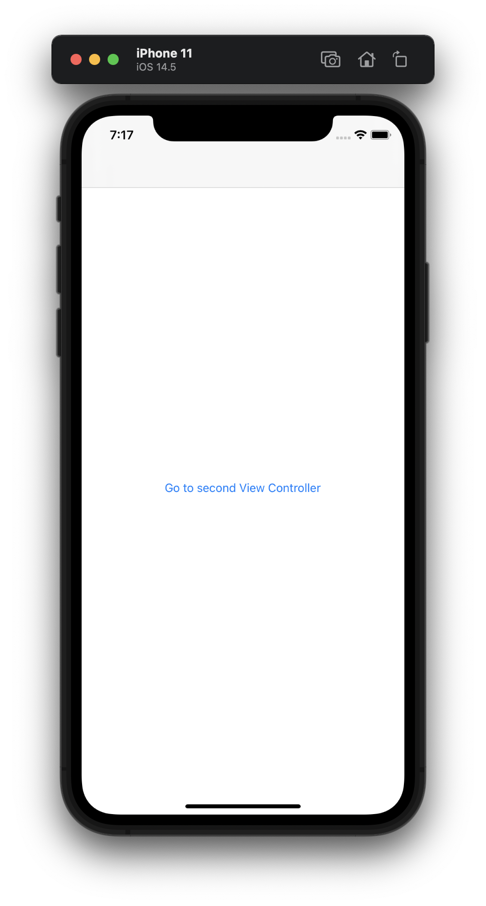
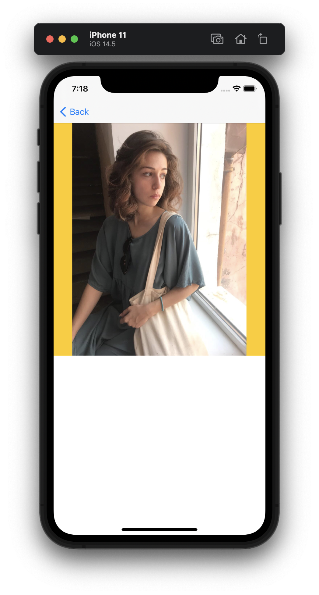
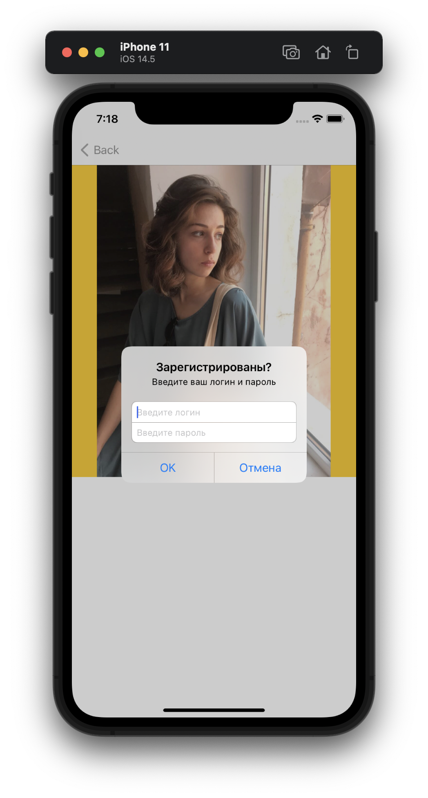

#  GCD_Beginner

This is a begginer project from [SWIFTBOOK.ru](https://swiftbook.ru) for practice Grand Central Dispatch - framework for concurrent code execution on multicore hardware.

There are two screens. On first screen set button with segue to second screen with image from url. For showing downloading image we set Activity Controller. But downloading files is highload task and this function we using in global concurrent queue with utility QoS class. Also, for demonstration of asyncAfter in main serial queue, we realized Alert Controller which appears 3 seconds after loading image.

## Demonstration

The first screen contains button with segue to first screen.

The second screen with loading image from URL in global concurrent queue.

Alert Controller which apperas 3 seconds after loading image.

