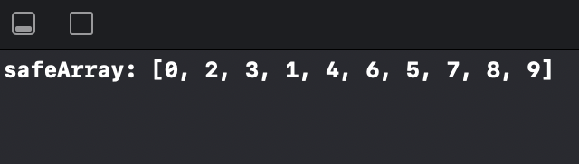

# GCD_Beginner 2

This is a begginer project from SWIFTBOOK.ru for practice Grand Central Dispatch - framework for concurrent code execution on multicore hardware.

In this project, we continued to study multithreading in Swift, but this time we got acquainted with the barriers. This is a playground project in which we implemented thread safe access (write and read) to the array.

## Demonstration

We have filled the array with elements from 0 to 9 and we see that they are all (important!) are present in it. However, the order is not guaranteed, since we used a concurrent queue.

