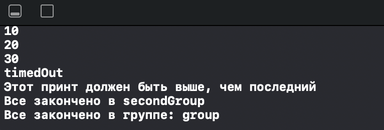

# GCD_Beginner 3

This is a begginer project from SWIFTBOOK.ru for practice Grand Central Dispatch - framework for concurrent code execution on multicore hardware.

In this project, we continued to study multithreading in Swift, but this time we got acquainted with the groups. This is a playground project in which we implemented groups creating, execution, notify and wait methods.

## Demonstration

Trying different configurations for using dispatch groups.

