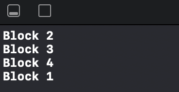

# GCD_Beginner 5

This is a begginer project from SWIFTBOOK.ru for practice Grand Central Dispatch - framework for concurrent code execution on multicore hardware.

In this project, we continued to study multithreading in Swift, but this time we got acquainted with the semaphores. This is a playground project in which we implemented groups creating, execution, signal and wait methods.

## Demonstration

We have, for example, semaphore with two threads. Block 1 performed for 4 seconds, block 2 performed for 2 seconds and blocks 3-4 have no execution time. We can see that block 1 to take for 4 seconds one of the threads and block 2 to take for 2 seconds second thread. So, block 2 is faster than block 2and finish execution as first. Then, instead of block 2 placed blocks 3-4 in order duration block 1 execution. Thus, block 1 ran the longest and ended last.

