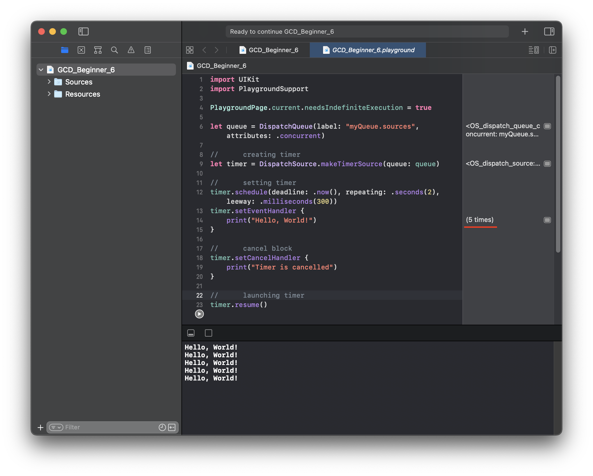

# GCD_Beginner 6

This is a begginer project from SWIFTBOOK.ru for practice Grand Central Dispatch - framework for concurrent code execution on multicore hardware.

In this project, we continued to study multithreading in Swift, but this time we got acquainted with the Dispatch Sources and its types. This is a playground project in which we implemented sources creating, settings and launch.

## Demonstration

We praticed type timer, set it on repeating for 5 seconds and print "Hello, World!" message. 

